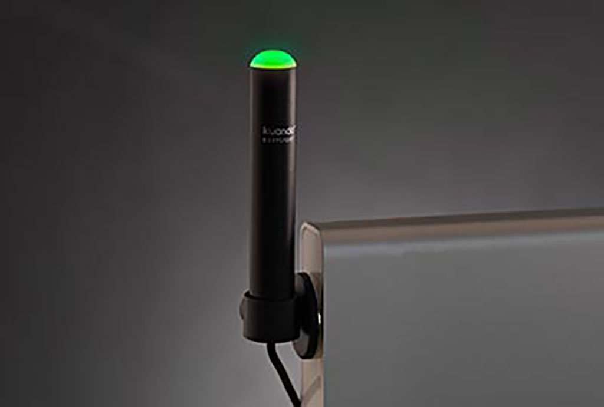

# Busylight MQTT Add-on for Home Assistant OS

A local add-on for **Home Assistant OS** that lets you control a **Kuando / Plenom Busylight UC Alpha** over **MQTT**.

This add-on listens on an MQTT topic and forwards commands to the Busylight over USB by using [`busylight-for-humans`](https://github.com/JnyJny/busylight).

It is useful if you want to use your Busylight as a status light for:

- meetings
- streaming
- Home Assistant automations
- Discord-related workflows
- dashboards and manual controls

---

## Hardware

This project is built for the **Kuando / Plenom Busylight UC Alpha**.

Official product page:  
[Busylight UC Alpha by Plenom](https://busylight.com/products/busylight-uc-alpha/)



---

## What this add-on does

This add-on:

- runs locally on **Home Assistant OS**
- connects to your **MQTT broker**
- listens for commands on a topic such as `busylight/control`
- sends those commands to the Busylight connected by USB

Example flow:

**Home Assistant automation → MQTT message → add-on → Busylight**

---

## What this add-on does not do

This add-on does **not** automatically create a light entity in Home Assistant.

It works by listening for MQTT commands.  
That means you control it using:

- `mqtt.publish` actions
- Home Assistant scripts
- Home Assistant automations
- dashboard buttons
- any other tool that can publish MQTT messages

---

## Features

- Control a Busylight UC Alpha over MQTT
- Runs as a local add-on on Home Assistant OS
- Supports simple payload commands
- Easy to use in automations and scripts
- Uses `busylight-for-humans` for actual Busylight control

Supported commands:

- `red`
- `green`
- `blue`
- `off`
- `black`
- `blink_blue`
- `list`

---

## Requirements

Before installing this add-on, make sure you have:

- **Home Assistant OS**
- a working **MQTT broker**
- the **Mosquitto Broker add-on** or another MQTT broker
- a valid **MQTT user and password**
- a **Kuando / Plenom Busylight UC Alpha** connected over USB
- access to `/addons/local/` on your Home Assistant system

---

## Confirmed hardware

Tested working with:

- **Kuando / Plenom Busylight Alpha**
- USB ID: `27bb:3bca`

---

## Folder structure

This repository contains a local add-on.

The important folder is:

```text
busylight_mqtt/
├─ config.yaml
├─ Dockerfile
└─ run.sh